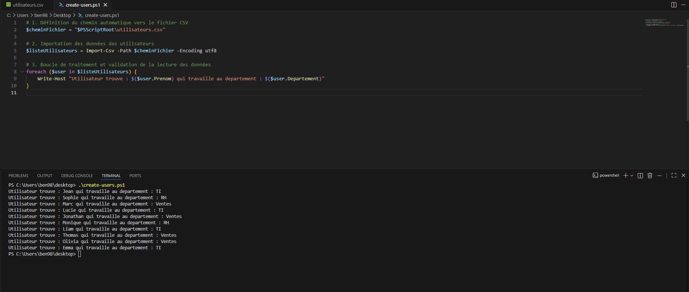
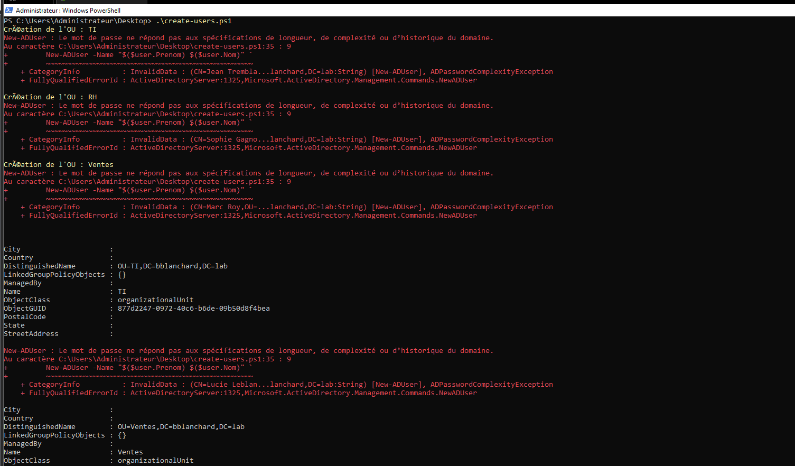
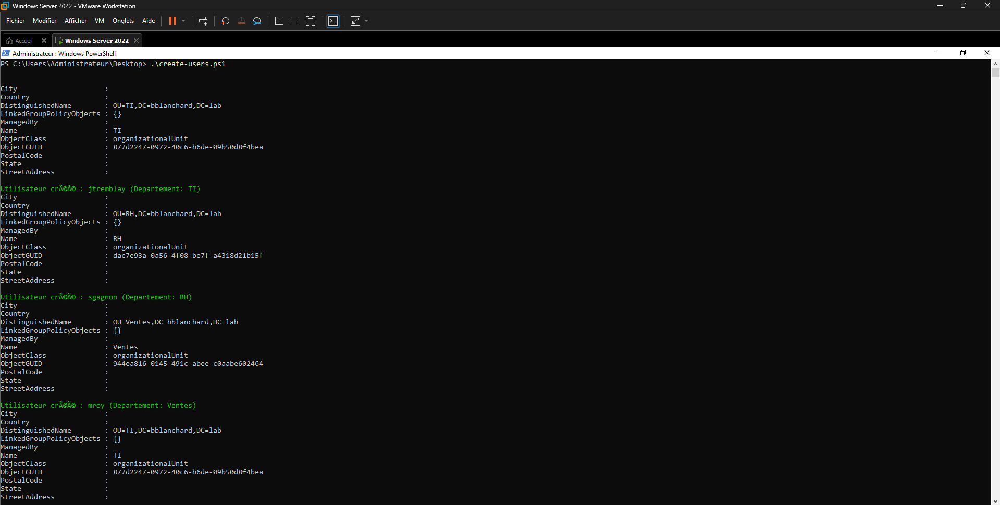
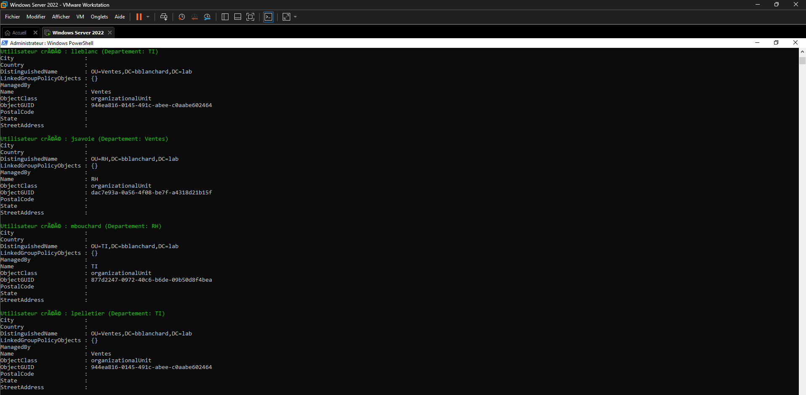
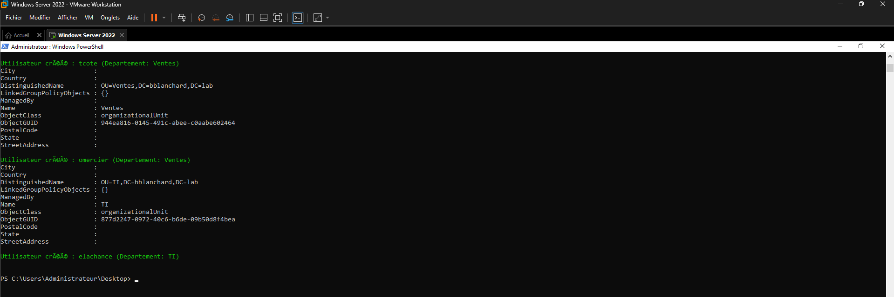
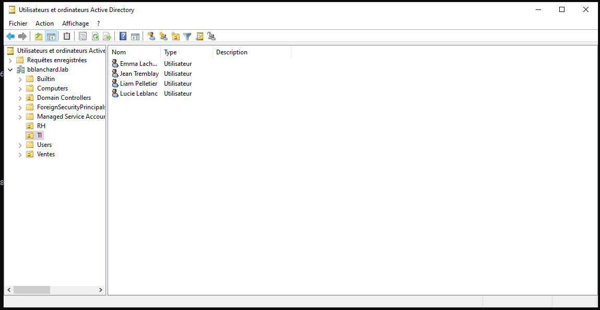
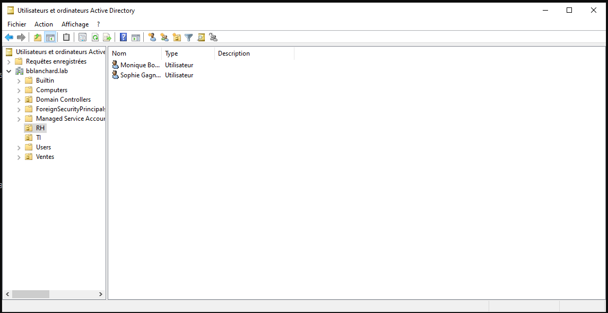
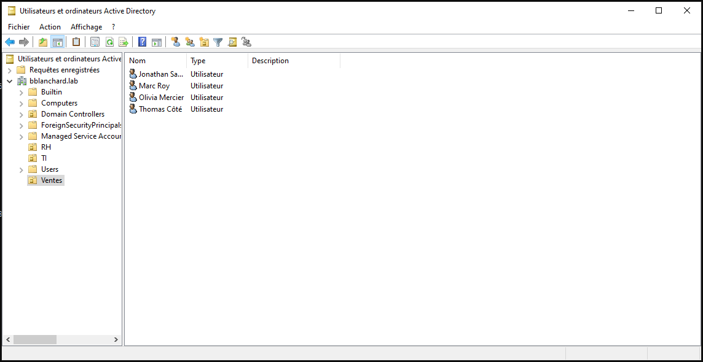

# Active Directory Automation - Provisioning d'utilisateurs via PowerShell

## Description du Projet
Ce projet présente une solution d'automatisation robuste conçue pour provisionner efficacement des comptes utilisateurs en masse dans un environnement Windows Server Active Directory (AD DS) à partir d'un fichier source CSV. 

En entreprise, la création manuelle de dizaines de comptes est une tâche répétitive, chronophage et sujette aux erreurs humaines (fautes de frappe, oublis de configuration ou incohérences dans les permissions). Ce script résout ces problématiques en automatisant l'intégralité du cycle de création : de la détection et génération des Unités Organisationnelles (OU) jusqu'à la configuration sécurisée des comptes d'employés.

---

## Objectifs Techniques & Fonctionnalités

* **Gestion et parsing des données :** Structuration et importation d'un fichier `.csv` contenant les informations des utilisateurs fictifs (Prénom, Nom, Département, Nom d'utilisateur).
* **Création dynamique de la structure AD (OUs) :** Le script vérifie en temps réel l'existence des Unités Organisationnelles basées sur les départements de l'entreprise (ex: TI, RH, Ventes). Si une OU est manquante, elle est automatiquement créée à la racine du domaine (`DC=bblanchard,DC=lab`).
* **Gestion des doublons (Idempotence) :** Avant chaque création d'utilisateur, le script valide si le `SamAccountName` existe déjà dans l'Active Directory afin d'éviter les interruptions et les conflits de réplication.
* **Sécurisation des accès (Best Practices) :** 
  * Génération d'un mot de passe temporaire robuste sous forme de chaîne sécurisée (`SecureString`) conforme aux exigences de complexité de l'AD.
  * Activation de l'attribut de changement obligatoire du mot de passe à la première connexion (`-ChangePasswordAtLogon $true`), garantissant la confidentialité des accès dès l'intégration de l'employé.
* **Journalisation et Verbosite (Logging) :** Utilisation d'un code couleur dynamique dans la console PowerShell (Jaune pour la création d'infrastructure, Vert pour les succès de création, Cyan pour les sauts de doublons) pour un suivi visuel rapide par l'administrateur.

---

## Technologies & Environnement Utilisés

* **Système d'exploitation :** Windows Server 2022 Core / Desktop Experience
* **Rôles Serveur :** Active Directory Domain Services (AD DS), DNS
* **Langage de script :** PowerShell 5.1 / 7+ (Module `ActiveDirectory`)
* **Environnement de test :** Infrastructure virtualisée sous VMware Workstation Pro

---

## Évolution du Projet et Résolution de Problèmes

### Étape 1 : Validation de la lecture des données (Version initiale)
La première version du script avait pour objectif unique de valider que PowerShell parvenait à lire et mapper correctement les colonnes du fichier CSV avant de faire des modifications sur l'infrastructure. 

**Code du script initial (V1) :**
```powershell
# Définition du chemin vers le fichier CSV
$cheminFichier = "$PSScriptRoot\utilisateurs.csv"

# Importation des données
$listeUtilisateurs = Import-Csv -Path$cheminFichier -Encoding utf8

# Boucle de validation de lecture
foreach ($user in$listeUtilisateurs) {
    Write-Host "Utilisateur trouvé : $($user.Prenom) dans le département : $($user.Departement)"
}

```


---

### Étape 2 : Blocage de sécurité (Erreur de complexité de mot de passe)
Une fois l'infrastructure Active Directory prête, la deuxième itération du script (version semi-finale) visait à automatiser la création conjointe des Unités Organisationnelles (OU) et des comptes utilisateurs directement depuis le fichier CSV.

**Code du script semi-final (V2) :**
```powershell
# Importation du module Active Directory
Import-Module ActiveDirectory

$cheminFichier = "$PSScriptRoot\utilisateurs.csv"
$listeUtilisateurs = Import-Csv -Path$cheminFichier -Encoding utf8

foreach ($user in $listeUtilisateurs) {$OU = "OU=$($user.Departement),DC=bblanchard,DC=lab"
    
    # Vérification et création de l'OU si manquante
    if (-not (Get-ADOrganizationalUnit -Filter "Name -eq '$($user.Departement)'")) {
        Write-Host "CRÉation de l'OU : $($user.Departement)"
        New-ADOrganizationalUnit -Name $($user.Departement) -Path "DC=bblanchard,DC=lab"
    }

    # Tentative de création de l'utilisateur sans mot de passe défini
    New-ADUser -Name "$($user.Prenom) $($user.Nom)" `
               -SamAccountName $user.Username `
               -UserPrincipalName "$($user.Username)@bblanchard.lab" `
               -Path $OU `
               -Enabled $true
}

```
**Résultat obtenu et Analyse de l'erreur dans la console :**
L'exécution de cette version semi-finale a généré un blocage critique visible dans la console :



Deux problèmes majeurs ont été identifiés lors de ce test :
1. **Erreur d'encodage de la console (UTF-8) :** Les messages de sortie affichaient un problème de décodage des accents (ex: `CRéation de l'OU : TI`). Cela indique que la console PowerShell par défaut n'interprétait pas correctement les caractères accentués du script.
2. **Blocage de sécurité AD (`ADPasswordComplexityException`) :** La commande `New-ADUser` (située à la ligne 35 du script) a renvoyé l'erreur système :  
   > *New-ADUser : Le mot de passe ne répond pas aux spécifications de longueur, de complexité ou d'historique du domaine.*

**Analyse technique :** 
Par défaut, un domaine Active Directory Windows Server applique strictement la politique `Default Domain Policy`. Tenter d'injecter et d'activer immédiatement (`-Enabled $true`) un compte utilisateur sans passer de paramètre `-AccountPassword` force l'AD à rejeter la requête, car la création d'un compte avec un mot de passe vide enfreint les critères de complexité obligatoires du domaine.

---

### Étape 3 : Implémentation de la solution (Script Final)
Pour résoudre l'erreur de sécurité et corriger les problèmes d'affichage, la version finale du script a été révisée avec succès.

**Code du script final (V3) :**
```powershell
# Configuration de la console pour supporter l'encodage UTF-8
[Console]::OutputEncoding = [System.Text.Encoding]::UTF8

# Importation du module Active Directory
Import-Module ActiveDirectory

$cheminFichier = "$PSScriptRoot\utilisateurs.csv"
$listeUtilisateurs = Import-Csv -Path$cheminFichier -Encoding utf8

# Définition d'un mot de passe temporaire sécurisé conforme aux exigences
$motDePasseBrut = "Bienvenue123!"
$motDePasseSecurise = ConvertTo-SecureString$motDePasseBrut -AsPlainText -Force

foreach ($user in $listeUtilisateurs) {$OU = "OU=$($user.Departement),DC=bblanchard,DC=lab"
    
    # Vérification et création dynamique de l'OU
    if (-not (Get-ADOrganizationalUnit -Filter "Name -eq '$($user.Departement)'")) {
        Write-Host "Création de l'OU : $($user.Departement)" -ForegroundColor Yellow
        New-ADOrganizationalUnit -Name $($user.Departement) -Path "DC=bblanchard,DC=lab"
    }

    # Vérification si l'utilisateur existe déjà (Idempotence)
    if (-not (Get-ADUser -Filter "SamAccountName -eq '$($user.Username)'")) {
        Write-Host "Création de l'utilisateur : $($user.Prenom) $($user.Nom)" -ForegroundColor Green
        
        New-ADUser -Name "$($user.Prenom) $($user.Nom)" `
                   -SamAccountName $user.Username `
                   -UserPrincipalName "$($user.Username)@bblanchard.lab" `
                   -Path $OU `
                   -AccountPassword $motDePasseSecurise `
                   -ChangePasswordAtLogon $true `
                   -Enabled $true
    } else {
        Write-Host "L'utilisateur $($user.Username) existe déjà. Passage au suivant." -ForegroundColor Cyan
    }
}
```
**Résultats obtenus et Preuves de succès (V3) :**

L'exécution finale du script démontre une automatisation fluide, sans aucune erreur rouge, respectant à la fois l'indempotence et la sécurité des données.

#### 1. Validation de l'exécution dans la console PowerShell
Les captures suivantes montrent l'exécution pas à pas du script, la création des objets et la détection intelligente des comptes existants :





#### 2. Structure finale validée dans l'Active Directory
Voici la validation visuelle directement dans la console *Utilisateurs et ordinateurs Active Directory* ($ADUC$). Les comptes ont été correctement injectés et répartis dans leurs Unités Organisationnelles respectives avec l'obligation de changer le mot de passe à la prochaine session :




